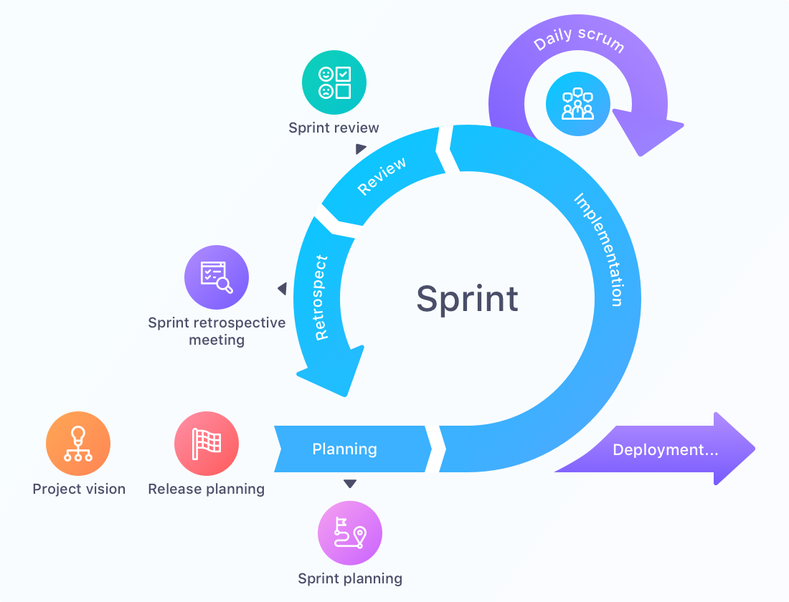

# 3.1 Projektmethode

Dieses Projekt wird mit einer Kombination aus Scrum und Kanban umgesetzt. Diese Methoden werden durch die Implementierung von Jira unterstützt, da das Projekt von einer einzelnen Person durchgeführt wird.

Scrum ist eine agile Methode, die Aufgaben in kleine, inkrementelle Schritte aufteilt und durch regelmäßige Zyklen, sogenannte Sprints, organisiert. Kanban hingegen bietet eine visuelle Darstellung des Arbeitsflusses, was besonders hilfreich ist, um den Fortschritt und die Priorisierung der Aufgaben in einem kontinuierlichen Prozess zu überwachen.

Der Einsatz dieser beiden Methoden, zusammen mit Jira, bietet eine flexible und transparente Arbeitsweise. Durch Sprints in Scrum wird der Fortschritt regelmäßig überprüft, während Kanban hilft, die Arbeit effizient zu organisieren und Engpässe zu vermeiden.

Die folgende Abbildung zeigt eine typische Scrum-Tafel, wie sie in Jira verwendet wird:

## Sprint

Ein Sprint ist das Herzstück der Scrum-Agilität und dauert in der Regel vier Wochen. Er umfasst folgende Phasen:

- Sprint Planning
- Daily Scrum
- Sprint Review
- Sprint Retrospective

Diese Phasen unterstützen den Sprint und sorgen für eine strukturierte Vorgehensweise sowie hohe Qualität.

## Sprint Planning

Im Sprint Planning werden Aufgaben aus dem Product Backlog in das aktuelle Sprint Backlog überführt. Alle im Sprint Backlog befindlichen Tickets müssen während des Sprints bearbeitet werden. Das Commitment zur Bearbeitung dieser Aufgaben gibt die einzelne Person, die das Projekt durchführt.

## Daily Scrum

Das Daily Scrum ist ein kurzes, tägliches Meeting, das immer zur gleichen Zeit stattfindet. Es hilft, mögliche Probleme frühzeitig zu erkennen und den Fortschritt des Sprints zu überwachen. Da das Projekt von einer einzigen Person umgesetzt wird, kann das Daily Scrum durch eine tägliche, persönliche Statusüberprüfung ersetzt werden. Die folgenden Fragen helfen dabei:

- Was habe ich gestern gemacht?
- Wo gab es Probleme?
- Was werde ich heute erledigen?

Diese Fragen sollten kurz und prägnant beantwortet werden, und die Überprüfung sollte nicht länger als 15 Minuten dauern. Es wird kein formelles Protokoll geführt.

## Sprint Review

Am Ende jedes Sprints findet das Sprint Review statt. In diesem Meeting wird der Fortschritt des Sprints überprüft und bewertet, ob alle Aufgaben erfolgreich abgeschlossen wurden.

## Sprint Retrospective

Die Sprint Retrospective bietet die Gelegenheit zur Reflexion über den vergangenen Sprint. Folgende Kernfragen werden behandelt:

- Keep / Beibehalten
  - Was hat gut funktioniert und sollte beibehalten werden?
- Drop / Stoppen
  - Was hat nicht gut funktioniert und sollte gestoppt werden?
- Try / Ausprobieren
  - Welche neuen Ansätze sollten im nächsten Sprint ausprobiert werden, um die Arbeitsweise zu verbessern?

Diese Reflexion hilft dabei, kontinuierlich zu lernen und die Arbeitsweise anzupassen.

## Kanban

Kanban wird genutzt, um den Arbeitsfluss kontinuierlich zu überwachen und Engpässe zu identifizieren. In Jira wird eine Kanban-Tafel eingerichtet, die den aktuellen Status aller Aufgaben visuell darstellt und hilft, Prioritäten zu setzen.

## Warum Lean-Ansatz sinnvoll wäre

Der Lean-Ansatz zielt darauf ab, Effizienz zu maximieren und Verschwendung zu minimieren. Dies wird durch kontinuierliche Verbesserung und die Konzentration auf den Wert für den Kunden erreicht. In der Praxis könnte der Lean-Ansatz in diesem Projekt folgende Vorteile bieten:

- **Fokussierung auf Wertschöpfung**: Nur Aufgaben, die direkten Nutzen für den Benutzer bieten, werden priorisiert und umgesetzt.
- **Reduzierung von Verschwendung**: Überflüssige Funktionen und Prozesse werden vermieden, was zu einer schlankeren und effizienteren Projektabwicklung führt.
- **Schnelle Anpassung**: Durch kontinuierliches Feedback und iterative Verbesserungen kann das Projekt flexibel auf Veränderungen reagieren und sich ständig weiterentwickeln.

## Warum trotzdem Scrum verwendet wird

Trotz der Vorteile des Lean-Ansatzes wird in diesem Projekt Scrum verwendet, hauptsächlich aus Lernzwecken:

- **Strukturierte Lernumgebung**: Scrum bietet eine klar strukturierte Methode mit definierten Rollen, Ereignissen und Artefakten, die eine gute Grundlage für das Lernen und Verstehen agiler Prinzipien bietet.
- **Zyklus-basierte Iterationen**: Die festen Zeiträume der Sprints in Scrum helfen dabei, den Fortschritt regelmäßig zu überprüfen und sicherzustellen, dass das Projekt in kleinen, handhabbaren Schritten voranschreitet.
- **Erfahrung mit agilen Praktiken**: Durch die Anwendung von Scrum können praktische Erfahrungen mit agilen Praktiken gesammelt werden, die in zukünftigen Projekten wertvoll sein können.

Durch die Kombination von Scrum und Kanban, unterstützt durch Jira, wird das Projekt effizient und flexibel verwaltet, während gleichzeitig wertvolle Kenntnisse und Fähigkeiten im Bereich agiler Methoden erworben werden.
