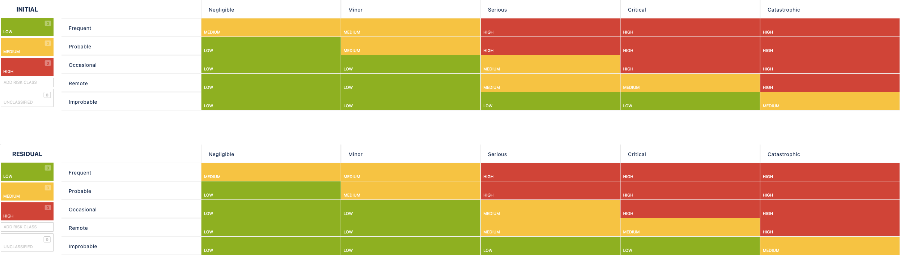

# 3.6 Risikomanagement

Für die Planung und Durchführung dieser Semesterarbeit wird Jira von Atlassian verwendet. Diese umfassende Softwarelösung erlaubt die Verwaltung von Risiken als separate "Issue-Typen", die nahtlos mit anderen Aufgaben verknüpft werden können. Zur Unterstützung wird Jira durch die App "Risk Manager" von SoftComply ergänzt, welche eine detaillierte Übersicht der Risiken in Form von Tabellen und grafischen Darstellungen ermöglicht.

## 3.6.1 Risikokategorien

Die Risiken werden nach ihrer Eintrittswahrscheinlichkeit und möglichen Auswirkungen bewertet. Diese Bewertung hilft bei der Priorisierung und der Entscheidung, wie mit den Risiken umgegangen werden soll. Nachdem Gegenmaßnahmen ergriffen wurden, wird das Restrisiko neu eingeschätzt, um die verbleibenden Gefahren besser zu verstehen.

### Kategorien der Eintrittswahrscheinlichkeit

- **Frequent / Häufig**: Hohe Wahrscheinlichkeit, dass das Risiko eintritt (z.B. regelmäßig bei jedem Sprint).
- **Probable / Wahrscheinlich**: Realistische Chance, dass das Risiko auftritt (z.B. einmal pro Projektphase).
- **Occasional / Gelegentlich**: Das Risiko tritt sporadisch auf (z.B. einmal pro Projekt).
- **Remote / Selten**: Das Risiko ist unwahrscheinlich, kann aber vorkommen (z.B. einmal in einigen Jahren).
- **Improbable / Unwahrscheinlich**: Sehr geringe Wahrscheinlichkeit (z.B. einmal in zehn Jahren).

### Kategorien der Auswirkung

- **Negligible / Unbedeutend**: Geringfügige Auswirkungen (z.B. leichte Verzögerung von wenigen Stunden).
- **Minor / Gering**: Geringfügige negative Auswirkungen (z.B. zusätzliche Arbeit von ein bis zwei Tagen).
- **Serious / Ernsthaft**: Bedeutende Auswirkungen, die das Projekt merklich beeinträchtigen können (z.B. Verzögerung von mehreren Tagen).
- **Critical / Kritisch**: Schwere Auswirkungen, die den Projektfortschritt erheblich stören (z.B. Verzögerung um Wochen).
- **Catastrophic / Katastrophal**: Sehr schwerwiegende Auswirkungen, die zum Scheitern des Projekts führen könnten (z.B. Abbruch des Projekts).

## 3.6.2 Zusätzliche Risiken

Neben den allgemeinen Risiken gibt es spezifische Herausforderungen in diesem Projekt:

- **Technische Kompetenzlücken**: Da ich kein Fullstack-Entwickler bin, könnte es Schwierigkeiten geben, ein reibungslos funktionierendes Frontend zu entwickeln. Besonders Herausforderungen könnten bei der Arbeit mit React auftreten, was den Entwicklungsprozess verzögern könnte.
- **Zeitdruck**: Das Projekt muss bis zum 05.07.2024 abgeschlossen sein. Dieser enge Zeitrahmen kann den Druck erhöhen und möglicherweise die Qualität der Arbeit beeinträchtigen.

## 3.6.3 Risikomanagement-Prozess

Die Risiken werden wöchentlich im PO-Sync-Meeting gemeinsam mit dem Business Owner besprochen und bewertet. Diese regelmäßige Besprechung stellt sicher, dass alle Risiken kontinuierlich überwacht und entsprechend ihrer Priorität bearbeitet werden. Die automatisierte Risikomatrix bietet eine umfassende Übersicht über alle aktuellen Risiken und ermöglicht eine effiziente Analyse. Zusätzlich können die Risiken in verschiedenen Formaten exportiert oder in tabellarischer Form angezeigt werden.