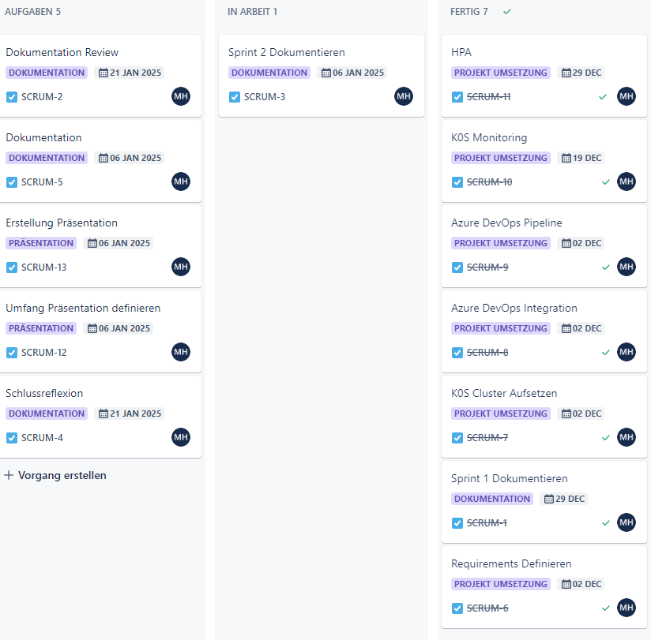

# Sprint1-Protokoll

**Datum / Uhrzeit**: 06.01.2025
**Ort**: Microsoft Teams  
**Teilnehmer**: 
- Student: Marc Hofstetter
- CNC SME: Philipp Stark
- PO/SME  : Philipp Rohr

Aufgrund der aktuellen ereignisse konnten die PO und SME nicht teilnehmen. Es gab jedoch ausserordentliche Abklärungen.

### Aktueller Fortschritt in Prozent

- **Dokumentation**: 70%
- **Umsetzung**: 95%
- **Präsentation**: 0%

### Aktueller Zeitplan

### Aktueller Entwicklungsstand

- **Erstellung des Kubernetes Clusters**: Der K8s Cluster konnte erfolgreich erstellt werden.
- **Azure Devops Pipeline**: Die Pipeline erstellt erfolgreich das Image und Deployed dies entsprechend auf dem K8s Cluster.
- **Monitoring des NGINX**: Das Monitoring konnte erfolgreich implementiert werden.
- **HPA des NGINX**: HPA wurde konfiguriert, leider bisher noch nicht getestet.
- **Dokumentation**: Die eigentliche Dokumentation zur Arbeit ist etwa 70% erledigt.
- **Frage an die Experten**: Keine.
- **Präsentation**: Die Präsentation wurde bisher noch nicht erstellt.

### Vergleich zu den Projektzielen

- **Projektziele**: Sind aktuell nicht gefährdet.

### Keep / Try / Drop

- **Keep**: 
- **Try**: Die Priorisierung des Projekts steht jetzt an oberster Stelle.
- **Drop**: Keine

### To Do

- **Dokumentation**: Dokumentation fortsetzen
- **Präsentation**: Präsentation erstellen

### Aufgetretene Probleme

- **Zeitmanagement**: Es gab keine größeren Probleme, abgesehen von Herausforderungen im Zeitmanagement.

### Backlog

- Siehe Punkte unter "To Do"
