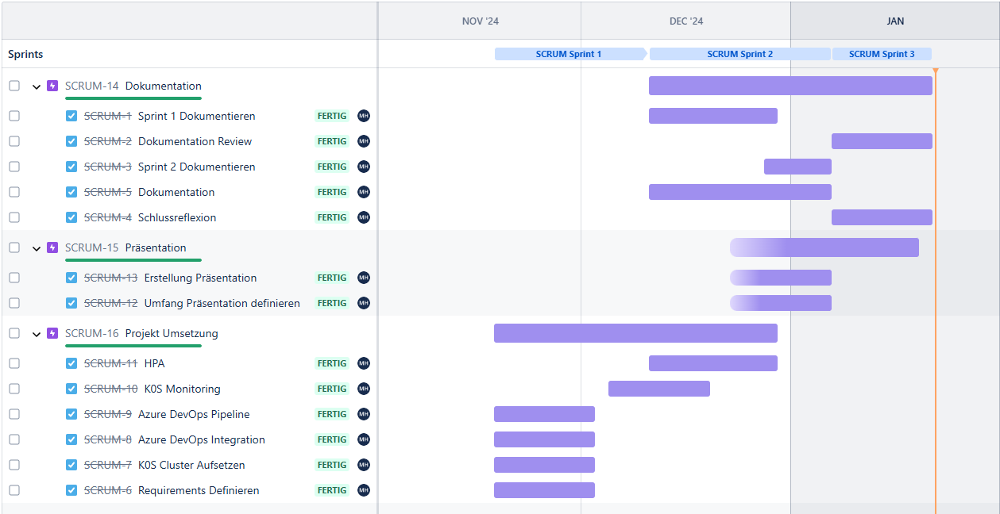
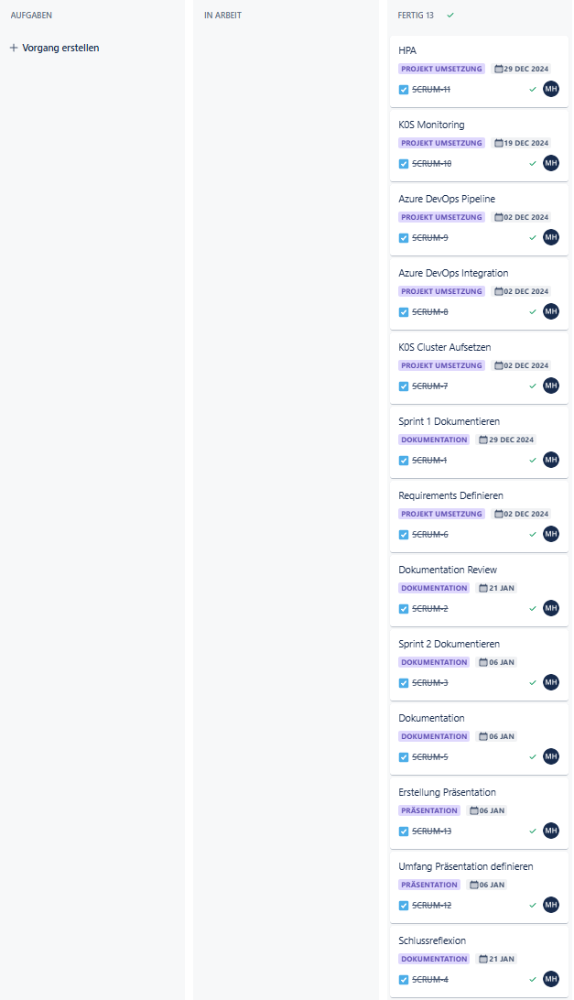

# Sprint1-Protokoll

**Datum / Uhrzeit**: 21.01.2025
**Ort**: Microsoft Teams  
**Teilnehmer**: 
- Student: Marc Hofstetter
- CNC SME: Philipp Stark
- PO/SME  : Philipp Rohr

Aufgrund der aktuellen ereignisse konnten die PO und SME nicht teilnehmen. Es gab jedoch ausserordentliche Abklärungen.

### Aktueller Fortschritt in Prozent

- **Dokumentation**: 100%
- **Umsetzung**: 100%
- **Präsentation**: 100%

### Aktueller Zeitplan

### Aktueller Entwicklungsstand

- **Technische Umsetzung**: Die Technische Umsetzung wurde fertiggestellt.
- **Dokumentation**: Die Technische Dokumentation wurde fertiggestellt.
- **Präsentation**: Die Präsentation wurde fertiggestellt.

### Vergleich zu den Projektzielen

- **Projektziele**: Alle Projektziele wurden erfolgreich umgesetzt.

### Keep / Try / Drop

- **Keep**: -
- **Try**: -
- **Drop**: -

### To Do

- **Finalisierung**: Rückmeldung und Präsenation der Arbeit

### Aufgetretene Probleme

- **Keine**

### Backlog

- Siehe Punkte unter "To Do"
