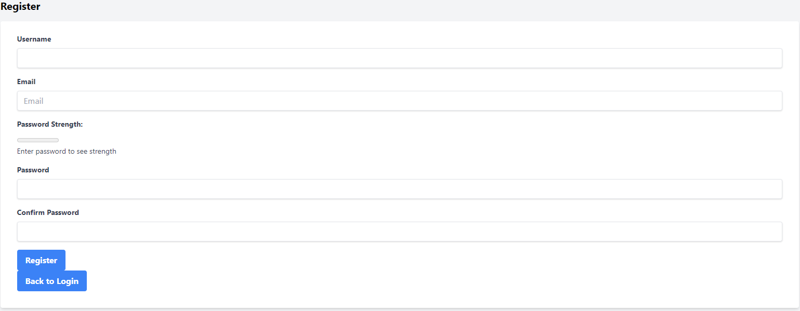
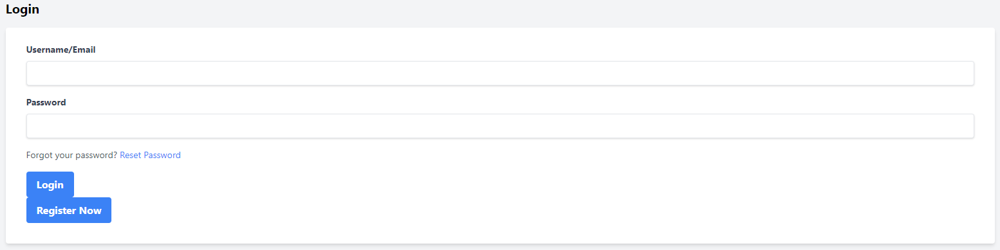
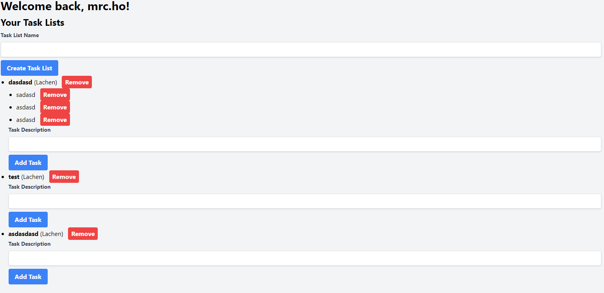
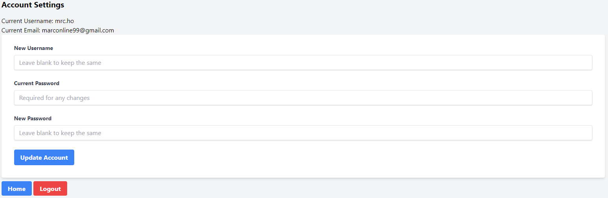

# 4.10 Application Layout

In diesem Abschnitt wird das Layout der «DOITNOW!» Anwendung beschrieben. Die folgenden Screenshots zeigen die verschiedenen Seiten der Anwendung und erklären deren Funktionen.

## Register

### Beschreibung
Die Registrierungsseite ermöglicht es neuen Benutzern, ein Konto zu erstellen. Die erforderlichen Eingabefelder sind:

- **Username**: Der Benutzername, den der Benutzer wählen möchte.
- **Email**: Die E-Mail-Adresse des Benutzers.
- **Password Strength**: Ein Indikator, der die Stärke des eingegebenen Passworts anzeigt.
- **Password**: Das Passwort, das der Benutzer für das Konto festlegen möchte.
- **Confirm Password**: Bestätigung des eingegebenen Passworts, um sicherzustellen, dass keine Tippfehler vorliegen.

### Funktionen
- **Register**: Sendet die Registrierungsdaten ab und erstellt ein neues Benutzerkonto.
- **Back to Login**: Leitet den Benutzer zurück zur Login-Seite.

## Login

### Beschreibung
Die Login-Seite ermöglicht es bestehenden Benutzern, sich in ihr Konto einzuloggen. Die erforderlichen Eingabefelder sind:

- **Username/Email**: Der Benutzername oder die E-Mail-Adresse des Benutzers.
- **Password**: Das Passwort des Benutzers.

### Funktionen
- **Login**: Überprüft die Anmeldeinformationen und loggt den Benutzer ein, wenn die Daten korrekt sind.
- **Register Now**: Leitet den Benutzer zur Registrierungsseite, falls dieser noch kein Konto besitzt.
- **Forgot your password? Reset Password**: Ermöglicht dem Benutzer, sein Passwort zurückzusetzen, falls er es vergessen hat.

## Main

### Beschreibung
Die Hauptseite zeigt die Aufgabenlisten des Benutzers und die darin enthaltenen Aufgaben. Der Benutzer kann neue Aufgabenlisten erstellen und Aufgaben zu bestehenden Listen hinzufügen.

### Funktionen
- **Create Task List**: Erstellt eine neue Aufgabenliste basierend auf dem eingegebenen Namen.
- **Add Task**: Fügt eine neue Aufgabe zur entsprechenden Aufgabenliste hinzu.
- **Remove**: Entfernt eine bestehende Aufgabe oder Aufgabenliste.
- **Task List Name**: Eingabefeld zum Erstellen einer neuen Aufgabenliste.
- **Task Description**: Eingabefeld zum Hinzufügen neuer Aufgaben zu einer bestehenden Liste.

## Account

### Beschreibung
Die Seite "Account Settings" ermöglicht es dem Benutzer, seine Kontoeinstellungen zu aktualisieren. Die Informationen, die geändert werden können, sind:

- **New Username**: Ein neuer Benutzername, falls der Benutzer diesen ändern möchte.
- **Current Password**: Das aktuelle Passwort, das für jede Änderung erforderlich ist.
- **New Password**: Ein neues Passwort, falls der Benutzer sein Passwort ändern möchte.

### Funktionen
- **Update Account**: Speichert die vorgenommenen Änderungen an den Kontoeinstellungen.
- **Home**: Leitet den Benutzer zurück zur Hauptseite.
- **Logout**: Loggt den Benutzer aus der Anwendung aus.
