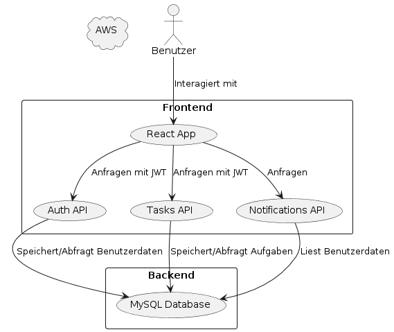

# 4.4 Technische Beschreibung der ToDo-Listen-Anwendung "DoItNow"

## 4.4.1 Überblick

Die "DoItNow"-Applikation ist eine Microservices-basierte ToDo-Listen-Anwendung, die es Benutzern ermöglicht, ihre Aufgaben zu verwalten und zu organisieren. Die Anwendung nutzt eine REST API, um die Kommunikation zwischen dem Frontend und Backend zu gewährleisten. Jeder Microservice ist für eine spezifische Funktion verantwortlich und wird in einem Docker-Container betrieben, was eine flexible Bereitstellung und Skalierung ermöglicht.

## 4.4.2 Anwendungsarchitektur

Die folgende Abbildung zeigt die Architektur der "DoItNow"-Applikation:

In der Abbildung sind die verschiedenen Komponenten und deren Interaktionen innerhalb der Applikation dargestellt:

1. **Frontend**:
   - **HTTP Templates**: Das Frontend der Anwendung sind mehrere HTTP Templates, welche dem Benutzer eine grafische Web Oberfläche bietet.
   - **Interaktionen**: Benutzer interagieren über das Frontend, indem sie Aufgaben erstellen, bearbeiten, löschen und anzeigen.

2. **Backend**:
   - **Auth API**: Ist für die Benutzerverwaltung, Registrierung und Authentifizierung zuständig.
   - **Tasks API**: Übernimmt die Aufgabenverwaltung , einschließlich Erstellen, Bearbeiten, Löschen und Abrufen von Aufgaben.
   - **Notifications API**: Ein Microservice, der Benachrichtigungen basierend auf bestimmten Ereignissen, wie z.B. fälligen Aufgaben, an Benutzer sendet.

3. **Datenbank**:
   - **MySQL Database**: Eine relationale Datenbank, die Benutzer- und Aufgabeninformationen speichert. Jeder Microservice greift auf die Datenbank zu, um die entsprechenden Daten zu speichern oder abzurufen.

4. **Cloud Hosting**:
   - **AWS**: Die Applikation wird auf Amazon Web Services (AWS) gehostet. Die verschiedenen Microservices laufen auf EC2-Instanzen.

### Diagramm: Datenfluss in der Anwendung

Um die Interaktion zwischen den verschiedenen Komponenten der Anwendung zu visualisieren, zeigt das folgende PlantUML-Diagramm den Datenfluss innerhalb der "DoItNow"-Applikation:

## 4.2.3 Beschreibung der Datenflüsse

Die Hauptdatenflüsse innerhalb der "DoItNow"-Applikation umfassen die Benutzerinteraktion mit der Anwendung, die Aufgabenverwaltung und das Versenden von Benachrichtigungen.

### Benutzerregistrierung und -anmeldung

- Benutzer interagieren mit der React-App im Frontend, um sich zu registrieren oder anzumelden.
- Diese Anfragen werden an die **Auth API** gesendet, die die Benutzerdaten validiert und in der MySQL-Datenbank speichert.
- Nach erfolgreicher Anmeldung wird eine **Session** erstellt und verwaltet, die bei zukünftigen Anfragen zur Authentifizierung dient.

### Aufgabenverwaltung

- Authentifizierte Benutzer verwenden das Frontend, um Aufgaben zu erstellen, zu bearbeiten oder zu löschen.
- Diese Anfragen werden an die **Tasks API** gesendet. Die **Tasks API** überprüft die Benutzer-Session und führt die gewünschten Aktionen durch.
- Die Aufgabeninformationen werden in der MySQL-Datenbank gespeichert oder abgerufen.

### Benachrichtigungen

- Der **Notifications API**-Service liest die relevanten Benutzerdaten aus der MySQL-Datenbank.
- Basierend auf Ereignissen wie fälligen Aufgaben sendet der Dienst Benachrichtigungen an die Benutzer.

## 4.2.4 Autorisierung

Die Anwendung verwendet **Flask Sessions** für die Autorisierung. Nach der Anmeldung erhält der Benutzer eine Session, die auf dem Server gespeichert wird und bei jeder nachfolgenden Anfrage an die API zur Authentifizierung genutzt wird. Diese Session enthält Informationen über die Benutzeridentität und seine Berechtigungen. Jeder Microservice überprüft die Session, um sicherzustellen, dass der Benutzer autorisiert ist, die angeforderte Aktion durchzuführen.

