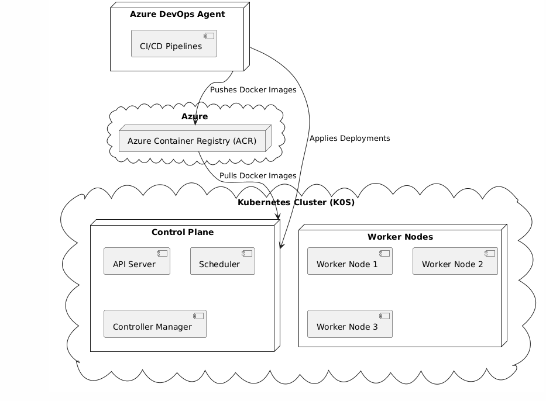

# 4.5 Azure DevOps Setup

## Übersicht der Infrastruktur

Das folgende Diagramm zeigt die Verbindungen zwischen dem Azure Container Registry (ACR), dem Azure DevOps Agent und dem Kubernetes-Cluster (K0S). Der DevOps Agent steuert sowohl das Pushen der Docker-Images zum ACR als auch die Bereitstellung dieser Images direkt im Kubernetes-Cluster. Die Verbindung erfolgt nicht über Azure DevOps, sondern direkt vom Agent zum Cluster.



## Einführung

Ich habe die Einrichtung der Azure DevOps-Umgebung durchgeführt, um das Azure Container Registry (ACR), den Azure DevOps Agent und den Kubernetes-Cluster (K0S) miteinander zu integrieren. Im Folgenden beschreibe ich die Schritte, die ich dafür umgesetzt habe:

1. Einrichtung eines Azure Container Registry (ACR).
2. Bereitstellung eines Azure DevOps Agents auf einem separaten virtuellen Server.
3. Verbindung des ACR, des DevOps Agents und des Kubernetes-Clusters.
4. Beschreibung der CI/CD-Pipeline in Azure DevOps.
5. Erstellung zusätzlicher Ressourcen (z. B. Deployment, Service, Dockerfile, HTML).

---

## 1. Einrichtung eines Azure Container Registry (ACR)

Das Azure Container Registry dient als Speicher für Docker-Images, die im Kubernetes-Cluster verwendet werden.

### Schritte:

1. **Erstellen eines neuen ACR:**
   - Ich habe im Azure-Portal ein neues Container Registry erstellt.
   - Dabei habe ich folgende Konfigurationen gewählt:
     - Subscription: Meine Azure Subscription.
     - Resource Group: `Sem4`.
     - Name: `SEM4ACR`.
     - SKU: `Basic`.

2. **Einrichten von Berechtigungen:**
   - Ich habe mithilfe des folgenden Befehls einen Service Principal erstellt, um Pull-Berechtigungen für das ACR zu erteilen:
     ```bash
     az ad sp create-for-rbac --name acr-pull --scopes $(az acr show --name SEM4ACR --resource-group Sem4 --query id --output tsv) --role acrpull --query "{appId:appId, password:password, tenant:tenant}" --output json
     ```
   - Die generierten Zugangsdaten (AppID, Passwort, Tenant) habe ich sicher gespeichert, da sie später für Kubernetes als Secret benötigt werden.

---

## 2. Bereitstellung eines Azure DevOps Agents

Ein Azure DevOps Agent ist erforderlich, um CI/CD-Pipelines auszuführen. Ich habe diesen Agent auf einem separaten virtuellen Server bereitgestellt.

### Warum ein separater Server?

- **Sicherheit:** Dadurch vermeide ich direkte Abhängigkeiten innerhalb des Kubernetes-Clusters.
- **Docker-in-Docker:** Der Agent kann eigenständig Container erstellen und verwalten.

### Schritte:

1. **Erstellen der virtuellen Maschine:**
   - Ich habe einen neuen Ubuntu-Server erstellt und Docker installiert:
     ```bash
     sudo apt update && sudo apt install -y docker.io
     sudo usermod -aG docker $USER
     ```
   - Zusätzlich habe ich das Docker Buildx-Plugin eingerichtet:
     ```bash
     sudo curl -SL https://github.com/docker/buildx/releases/latest/download/buildx-linux-amd64 -o /usr/libexec/docker/cli-plugins/docker-buildx
     sudo chmod +x /usr/libexec/docker/cli-plugins/docker-buildx
     sudo systemctl restart docker
     ```

2. **Einrichten des Azure DevOps Agents:**
   - Ich habe den Agent heruntergeladen und eingerichtet:
     ```bash
     mkdir myagent && cd myagent
     curl -O https://vstsagentpackage.azureedge.net/agent/2.213.2/vsts-agent-linux-x64-2.213.2.tar.gz
     tar zxvf vsts-agent-linux-x64-2.213.2.tar.gz
     ./config.sh --url https://dev.azure.com/<organization> --auth PAT --token <personal-access-token>
     ```
   - Schließlich habe ich den Agent als Dienst installiert und gestartet:
     ```bash
     sudo ./svc.sh install
     sudo ./svc.sh start
     ```

---

## 3. Verbindung zwischen ACR, DevOps Agent und Kubernetes

### Schritte:

1. **Kubernetes-Secret für ACR erstellen:**
   - Mit den zuvor gespeicherten Zugangsdaten habe ich ein Docker-Registry-Secret im Kubernetes-Cluster erstellt:
     ```bash
     kubectl create secret docker-registry acr-secret \
       --docker-server=sem4acr.azurecr.io \
       --docker-username=<appId> \
       --docker-password=<password> \
       --docker-email=<email>
     ```
   - Zur Verifikation habe ich den Secret-Inhalt überprüft:
     ```bash
     kubectl get secret acr-secret -n default -o jsonpath='{.data.\.dockerconfigjson}' | base64 -d
     ```

2. **ServiceAccount für Azure DevOps einrichten:**
   - Ich habe eine YAML-Datei erstellt, um einen ServiceAccount und die zugehörige ClusterRoleBinding zu konfigurieren:

```yaml
apiVersion: v1
kind: ServiceAccount
metadata:
name: azure-devops-sa
namespace: default
---
kind: ClusterRoleBinding
apiVersion: rbac.authorization.k8s.io/v1
metadata:
name: azure-devops-rolebinding
subjects:
- kind: ServiceAccount
    name: azure-devops-sa
    namespace: default
roleRef:
kind: ClusterRole
name: cluster-admin
apiGroup: rbac.authorization.k8s.io
```

   - Ich habe die Datei mit folgendem Befehl angewendet:
```bash
kubectl apply -f azure-devops-sa.yaml
```

3. **Abrufen des Service-Account-Tokens:**
   - Um das ServiceAccount-Token zu erhalten, habe ich den folgenden Befehl ausgeführt:
     ```bash
     kubectl describe secret $(kubectl get secrets | grep azure-devops-sa | awk '{print $1}') -n default
     ```
   - Dieses Token wurde direkt im DevOps-Agenten genutzt, um mit dem Kubernetes-Cluster zu interagieren.

4. **Direkte Verbindung vom DevOps-Agenten zu Kubernetes:**
   - Der DevOps-Agent kommuniziert direkt mit dem Kubernetes-Cluster. Dazu werden `kubectl`-Befehle innerhalb der Pipeline-Skripte verwendet, um Deployments und andere Ressourcen im Cluster zu verwalten.

5. **ImagePull-Test:**
   - Ich habe einen Test-Pod erstellt, um sicherzustellen, dass Kubernetes das Docker-Image aus dem ACR ziehen kann:

```yaml
apiVersion: v1
kind: Pod
metadata:
name: test-pod
spec:
containers:
- name: nginx
    image: sem4acr.azurecr.io/nginx:latest
imagePullSecrets:
- name: acr-secret
```
```bash
kubectl apply -f test-pod.yaml
kubectl describe pod test-pod
```

## 4. CI/CD-Pipeline Beschreibung

### Inhalte der Pipeline

```yaml
trigger:
- main

pool:
  name: Sem4

variables:
  ACR_NAME: 'SEM4ACR'
  IMAGE_NAME: 'nginx-static-content'
  IMAGE_TAG: '$(Build.BuildId)'

stages:
- stage: BuildAndPush
  displayName: Build and Push Image
  jobs:
  - job: Build
    displayName: Build Docker Image
    steps:
    - task: Docker@2
      displayName: Build and Push Image to ACR
      inputs:
        containerRegistry: 'SEM4_ACR_CONNECTION'
        repository: '$(IMAGE_NAME)'
        command: 'buildAndPush'
        Dockerfile: 'Dockerfile'
        tags: |
          $(IMAGE_TAG)
    - script: |
        echo "Replacing '\$(acr_version)' with Build ID: $(Build.BuildId)"
        sed -i 's/$(acr_version)/$(Build.BuildId)/g' kubernetes/deployment.yaml
        echo "Modified deployment.yaml:"
        cat kubernetes/deployment.yaml  # Debugging output
      displayName: Replace Variable with Version
    - task: PublishPipelineArtifact@1
      displayName: Publish Updated Manifest
      inputs:
        targetPath: 'kubernetes/deployment.yaml'
        artifact: 'deployment-manifest'

- stage: Deploy
  displayName: Deploy to Kubernetes
  dependsOn: BuildAndPush
  jobs:
  - job: DeployToKubernetes
    displayName: Deploy NGINX to K0S
    steps:
    - task: DownloadPipelineArtifact@2
      displayName: Download Updated Manifest
      inputs:
        artifactName: 'deployment-manifest'
        targetPath: 'kubernetes'
    - script: |
        echo "Final deployment.yaml before applying:"
        cat kubernetes/deployment.yaml
        echo "Applying Kubernetes manifests:"
        kubectl delete deployment nginx-deployment
        kubectl apply -f kubernetes/deployment.yaml
        kubectl apply -f kubernetes/nginx_service.yaml
        kubectl apply -f kubernetes/metrics_service.yaml
      displayName: Apply Kubernetes Manifests
```

## 5. Zusätzliche Dateien

### 1. `kubernetes/deployment.yaml`

Beschreibt die Bereitstellung des Docker-Containers im Kubernetes-Cluster.

```yaml
apiVersion: apps/v1
kind: Deployment
metadata:
  name: nginx-deployment
  namespace: default
spec:
  replicas: 1
  selector:
    matchLabels:
      app: nginx
  template:
    metadata:
      labels:
        app: nginx
    spec:
      containers:
      - name: nginx
        image: sem4acr.azurecr.io/nginx-static-content:$(acr_version)
        ports:
        - containerPort: 80
        imagePullPolicy: Always
        resources:
          requests:
            cpu: "250m"
            memory: "256Mi"
          limits:
            cpu: "500m"
            memory: "512Mi"
      - name: nginx-prometheus-exporter
        image: nginx/nginx-prometheus-exporter:latest
        args: ["-nginx.scrape-uri", "http://localhost/nginx_status"]
        ports:
        - containerPort: 9113
        resources:
          requests:
            cpu: "100m"
            memory: "128Mi"
          limits:
            cpu: "200m"
            memory: "256Mi"
      imagePullSecrets:
      - name: acr-secret
```

### 2. `kubernetes/nginx_service.yaml`

Konfiguriert den Service als NodePort.

```yaml
apiVersion: v1
kind: Service
metadata:
  name: nginx-public-service
  namespace: default
  labels:
    app: nginx-public
spec:
  type: NodePort
  ports:
    - name: public
      protocol: TCP
      port: 80
      targetPort: 80
      nodePort: 30001
  selector:
    app: nginx
```

### 3. `Dockerfile`

Definiert das Docker-Image.

```dockerfile
FROM nginx:latest
COPY ./html /usr/share/nginx/html
COPY ./nginx/nginx.conf /etc/nginx/nginx.conf
```

### 4. NGINX HTML Datei `html/index.html`

Eine Beispiel-HTML-Datei.

```html
<!DOCTYPE html>
<html lang="en">
<head>
    <meta charset="UTF-8">
    <meta name="viewport" content="width=device-width, initial-scale=1.0">
    <title>Sample HTML Page</title>
    <style>
        body {
            font-family: Arial, sans-serif;
            background-color: #f0f0f0;
            margin: 0;
            padding: 0;
        }
        header {
            background-color: #333;
            color: white;
            padding: 10px 0;
            text-align: center;
        }
        main {
            padding: 20px;
            text-align: center;
        }
        footer {
            background-color: #333;
            color: white;
            padding: 10px 0;
            text-align: center;
            position: fixed;
            width: 100%;
            bottom: 0;
        }
        a {
            color: #007BFF;
            text-decoration: none;
        }
    </style>
</head>
<body>
    <header>
        <h1>Welcome to My Sample HTML Page</h1>
    </header>
    <main>
        <p>Das ist die Sample HTML Page der SEM4.</p>
        <p>version: 1.0.</p>
    </main>
    <footer>
        <p>&copy; 2024 Sample HTML Page. All rights reserved.</p>
    </footer>
</body>
</html>
```

### 4. Sample Ingress File

Demonstriert die Konfiguration eines Ingress Controllers für nginx (für spätere produktive Umgebungen).

```yaml
apiVersion: networking.k8s.io/v1
kind: Ingress
metadata:
  name: nginx-ingress
  annotations:
    nginx.ingress.kubernetes.io/rewrite-target: /
spec:
  rules:
  - host: example.com
    http:
      paths:
      - path: /
        pathType: Prefix
        backend:
          service:
            name: nginx-service
            port:
              number: 80
```

---

Mit diesen Schritten habe ich die Azure DevOps-Integration erfolgreich umgesetzt. Die NodePort-Konfiguration bietet einfachen Zugriff auf die Anwendung, ohne dass ein Ingress-Controller benötigt wird. Für produktive Umgebungen könnte jedoch ein Ingress sinnvoll sein.
