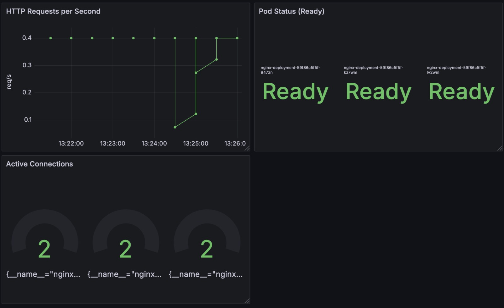

## 4.7 Horizontaler Pod Autoscaler (HPA)


Der **Horizontal Pod Autoscaler (HPA)** ist eine Kubernetes-Ressource, die die Anzahl der **Replikate eines Deployments, ReplicaSets oder StatefulSets** automatisch basierend auf der CPU- oder Speicher-Auslastung skaliert.

### Was ist der Horizontal Pod Autoscaler (HPA)?
- HPA überwacht die **CPU- und Speichernutzung von Pods** und passt die Anzahl der Replikate automatisch an.
- Standardmäßig basiert HPA auf den **Metriken des `metrics-server`**.
- Er kann auch mit **Prometheus-basierten benutzerdefinierten Metriken** erweitert werden.
- Ziel: Sicherstellen, dass **genügend Pods** laufen, um die Last zu bewältigen, aber nicht zu viele Ressourcen verschwendet werden.


## Installation des `metrics-server` für HPA

Der **Metrics Server** wird benötigt, da er die CPU- und Speichernutzung für Pods bereitstellt. Installiere ihn mit **Helm**:

```sh
helm repo add metrics-server https://kubernetes-sigs.github.io/metrics-server/
helm repo update
helm install metrics-server metrics-server/metrics-server -n kube-system
```

### Überprüfen, ob der Metrics Server läuft
```sh
kubectl get pods -n kube-system | grep metrics-server
```
Falls der Metrics Server nicht läuft, überprüfe die Logs:
```sh
kubectl logs -l app.kubernetes.io/name=metrics-server -n kube-system
```


## Erstellen der `hpa.yaml` Datei für Nginx

Wir erstellen eine **HPA-Ressource für ein Nginx-Deployment**, das automatisch skaliert, wenn CPU oder Speicher 50 % überschreiten.

```yaml
apiVersion: autoscaling/v2
kind: HorizontalPodAutoscaler
metadata:
  name: nginx-hpa
  namespace: default
spec:
  scaleTargetRef:
    apiVersion: apps/v1
    kind: Deployment
    name: nginx-deployment
  minReplicas: 1
  maxReplicas: 5
  metrics:
  - type: Resource
    resource:
      name: cpu
      target:
        type: Utilization
        averageUtilization: 50 # Scale wenn CPU über 50% ist
  - type: Resource
    resource:
      name: memory
      target:
        type: Utilization
        averageUtilization: 50 # Scale wenn Speicher über 50% ist
```


## HPA in Kubernetes Anwenden

Wende die HPA-Ressource mit `kubectl apply` an:
```sh
kubectl apply -f hpa.yaml
```

**Überprüfen, ob HPA erstellt wurde:**
```sh
kubectl get hpa -n default
```

Beispielausgabe:
```
kubectl get pods -n default
NAME        REFERENCE                     TARGETS                        MINPODS   MAXPODS   REPLICAS   AGE
nginx-hpa   Deployment/nginx-deployment   cpu: 30%/50%, memory: 8%/50%   1         5         1          3m20s
```

## Testen des HPA

Da HPA nur skaliert, wenn die CPU-/Speichernutzung **über 50 %** liegt, kann ich dies mit **`stress-ng`** simulieren.

### CPU-Last erzeugen mit `stress-ng`
Exec in einen Nginx-Pod und installiere `stress-ng`:
```sh
root@nginx-deployment-59f86c5f5f-kz7wm:/# apt update && apt install -y stress-ng
root@nginx-deployment-59f86c5f5f-kz7wm:/# stress-ng --cpu 1 --cpu-load 90 --timeout 120s
stress-ng: info:  [408] setting to a 120 second (2 mins, 0.00 secs) run per stressor
stress-ng: info:  [408] dispatching hogs: 1 cpu
```

### Überprüfen, ob HPA skaliert
```sh
kubectl get hpa -n default
kubectl get pods -n default
```

Wie im folgenden Output zu sehen ist, wird automatisch durch den HPA horizontal skaliert.

```sh
ubuntu@cloud-hf-16-c1:~$ kubectl get hpa -n default
kubectl get pods -n default
NAME        REFERENCE                     TARGETS                        MINPODS   MAXPODS   REPLICAS   AGE
nginx-hpa   Deployment/nginx-deployment   cpu: 85%/50%, memory: 8%/50%   1         5         1          3m20s
NAME                                READY   STATUS              RESTARTS   AGE
metrics-server-85f985c745-x6grm     1/1     Running             0          6m56s
nginx-deployment-59f86c5f5f-947zn   0/2     ContainerCreating   0          4s
nginx-deployment-59f86c5f5f-kz7wm   2/2     Running             0          29d
ubuntu@cloud-hf-16-c1:~$ kubectl get hpa -n default
NAME        REFERENCE                     TARGETS                        MINPODS   MAXPODS   REPLICAS   AGE
nginx-hpa   Deployment/nginx-deployment   cpu: 85%/50%, memory: 8%/50%   1         5         1          3m30s
ubuntu@cloud-hf-16-c1:~$ kubectl get pods -n default
NAME                                READY   STATUS              RESTARTS   AGE
metrics-server-85f985c745-x6grm     1/1     Running             0          7m7s
nginx-deployment-59f86c5f5f-947zn   0/2     ContainerCreating   0          15s
nginx-deployment-59f86c5f5f-kz7wm   2/2     Running             0          29d
ubuntu@cloud-hf-16-c1:~$ kubectl get hpa -n default
NAME        REFERENCE                     TARGETS                         MINPODS   MAXPODS   REPLICAS   AGE
nginx-hpa   Deployment/nginx-deployment   cpu: 143%/50%, memory: 8%/50%   1         5         2          3m33s
ubuntu@cloud-hf-16-c1:~$ kubectl get pods -n default
NAME                                READY   STATUS              RESTARTS   AGE
metrics-server-85f985c745-x6grm     1/1     Running             0          7m10s
nginx-deployment-59f86c5f5f-947zn   0/2     ContainerCreating   0          18s
nginx-deployment-59f86c5f5f-kz7wm   2/2     Running             0          29d
nginx-deployment-59f86c5f5f-lv2wm   0/2     ContainerCreating   0          3s
```

### HPA & Graphana

Im Folgenden Bild ist zu sehen, wie graphana automatisch die neuen Pods im Dashboard anzeigt.

