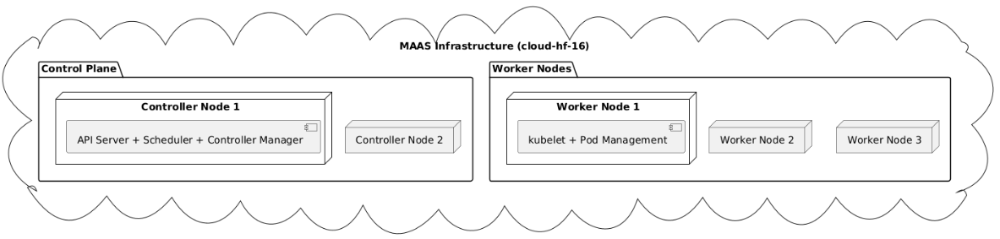

# 4.4 Kubernetes Cluster Setup

## Einführung

In diesem Abschnitt wird die Einrichtung eines K0s-Clusters auf der schuleigenen MAAS-Infrastruktur beschrieben. Dabei wurde Terraform zur Automatisierung der VM-Bereitstellung und Cloud-Init zur Initialisierung des Clusters verwendet. Der Cluster besteht aus Controller- und Worker-Knoten und ist für die Verwaltung containerisierter Anwendungen optimiert.

## Voraussetzungen

- Zugriff auf die MAAS-Infrastruktur mit einem API-Key und URL.
- Installiertes Terraform auf dem lokalen Rechner.
- SSH-Schlüssel zur Authentifizierung zwischen den Knoten.

## Terraform Setup

Der K0S Cluster wird folgende struktur haben:



Wie zu sehen ist, wird hier der K0S-Cluster mit zwei Controllern und drei Workern aufgesetzt. Ein Controller und zwei Worker wären für das Projekt ausreichend gewesen, die gewählte Konfiguration bietet jedoch zusätzliche Redundanz und Skalierbarkeit.

### Provider-Konfiguration (`provider.tf`)

```
terraform {
  required_providers {
    maas = {
      source  = "mc-b/lernmaas"
      version = ">=2.4.1"
    }
  }
}

provider "maas" {
  api_version = "2.0"
  api_url     = var.url
  api_key     = var.key
}
```

### Variablen (`variables.tf`)

```
variable "url" {
  description = "URL des MAAS-API-Servers"
  type        = string
}

variable "key" {
  description = "API-Key für den Zugriff"
  type        = string
  sensitive   = true
}
```

### Hauptkonfiguration (`main.tf`)
```
locals {
  worker_instances_count     = 3
  controller_instances_count = 2
}

resource "maas_vm_instance" "k8s_controller_init" {
  kvm_no    = data.maas_vm_host.default.no
  cpu_count = 2
  memory    = 4096
  storage   = 30
  hostname  = "cloud-hf-16-c1"
  zone      = "10-3-24-0"
  user_data = file("${path.module}/cloud_init_k0s.yaml")
}

resource "maas_vm_instance" "k8s_controller" {
  for_each  = local.controller_instances_list
  cpu_count = 2
  memory    = 4096
  storage   = 30
  hostname  = "cloud-hf-16-c${each.key}"
}

resource "maas_vm_instance" "k8s_worker" {
  for_each  = local.worker_instances_list
  cpu_count = 2
  memory    = 4096
  storage   = 12
  hostname  = "cloud-hf-16-w${each.key}"
}
```

### Cloud-Init-Konfiguration (`cloud_init_k0s.yaml`)
```yaml
#cloud-config
package_update: true
package_upgrade: true
packages:
  - curl
  - sudo
  - openssh-client

write_files:
  - path: /opt/k0s.yaml
    permissions: '0644'
    content: |
      apiVersion: k0sctl.k0sproject.io/v1beta1
      kind: Cluster
      metadata:
        name: cloud-hf-16
      spec:
        hosts:
        - ssh:
            address: cloud-hf-16-c1
            user: ubuntu
            port: 22
            keyPath: /opt/id_lerncloud
          role: controller
        - ssh:
            address: cloud-hf-16-w1
            user: ubuntu
            port: 22
            keyPath: /opt/id_lerncloud
          role: worker

runcmd:
  - curl -sSLf https://github.com/k0sproject/k0sctl/releases/latest/download/k0sctl-linux-amd64 -o /usr/local/bin/k0sctl
  - chmod +x /usr/local/bin/k0sctl
  - k0sctl apply --config /opt/k0s.yaml
```


### K0S Cluster aufsetzen
Terraform ausführen:

```bash
terraform init
terraform apply -auto-approve
```

Cloud-Init führt automatisch die Installation und Konfiguration des K0s-Clusters durch.

Nach der dem eingetlichen Setup des Clusters habe ich noch folgende Schritte durchgeführt um die Einrichtung zu komplettieren:

```bash
sudo snap install kubectl --classic
k0s
k0s kubeconfig admin > ~/.kube/config
mkdir .kube
k0s kubeconfig admin > ~/.kube/config
sudo k0s kubeconfig admin > ~/.kube/config
export KUBECONFIG=~/.kube/config
kubectl get nodes
sudo apt update
sudo apt install bash-completion -y
source <(kubectl completion bash)
echo "source <(kubectl completion bash)" >> ~/.bashrc
echo '[[ $- == *i* ]] && source /usr/share/bash-completion/bash_completion' >> ~/.bashrc
echo "source <(kubectl completion bash)" >> ~/.bashrc
```