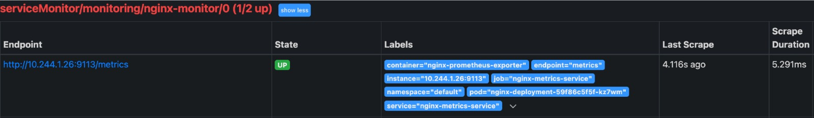
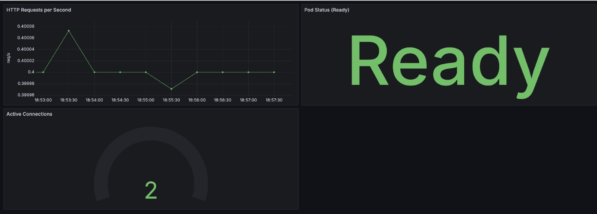
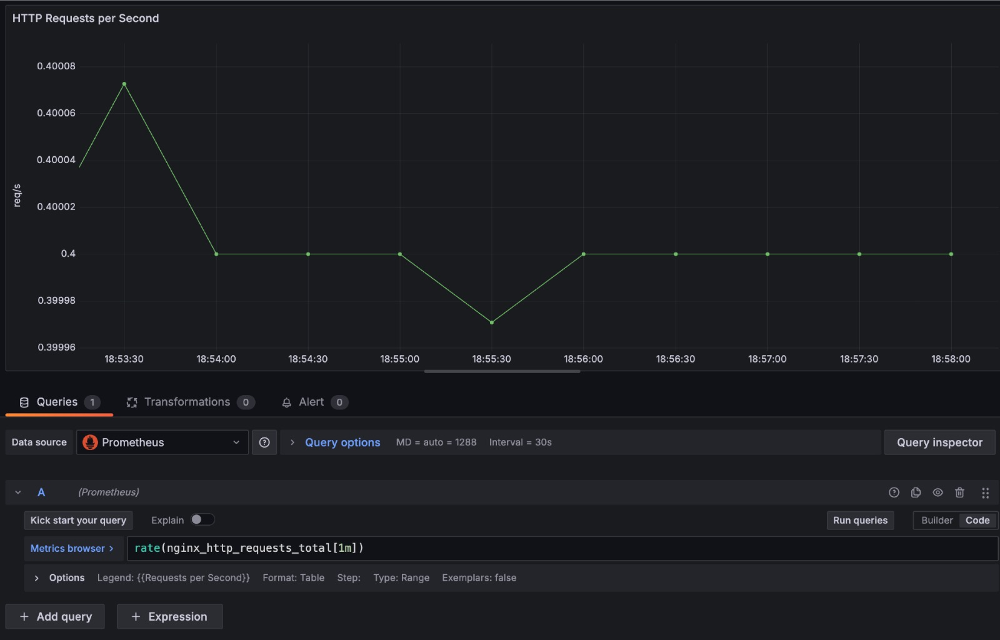

# 4.6 Monitoring

## Einführung

In diesem Abschnitt beschreibe ich, wie ich Prometheus und Grafana installiert und konfiguriert habe, um ein Monitoring für meinen Kubernetes-Cluster einzurichten. Dabei überwache ich spezifisch die NGINX-Pods und stelle die Daten in einem finalen Grafana-Dashboard dar. Ich erkläre Schritt für Schritt, wie ich Prometheus und Grafana mithilfe von Helm installiert und konfiguriert habe, einschließlich der Integration eines `ServiceMonitor` zur Überwachung der NGINX-Pods.

---

## 1. Installation von Prometheus und Grafana

### Vorbereitung: Helm installieren
Zuerst habe ich Helm installiert, das ich für die einfache Bereitstellung der Monitoring-Tools verwendet habe:

```bash
curl https://raw.githubusercontent.com/helm/helm/main/scripts/get-helm-3 | bash
```

### Prometheus und Grafana mit Helm installieren
Mit Helm habe ich den `kube-prometheus-stack` installiert. Dies umfasst sowohl Prometheus als auch Grafana.

```bash
helm repo add prometheus-community https://prometheus-community.github.io/helm-charts
helm repo update
helm install prometheus-stack prometheus-community/kube-prometheus-stack --namespace monitoring --create-namespace \
  --set grafana.service.type=NodePort \
  --set grafana.service.nodePort=30002 \
  --set prometheus.service.type=NodePort \
  --set prometheus.service.nodePort=30003
```

Mit diesen Befehlen habe ich sowohl Prometheus als auch Grafana als NodePort-Dienste bereitgestellt, um über die entsprechenden Ports (30002 für Grafana und 30003 für Prometheus) darauf zugreifen zu können.

### Zugriff auf Grafana
Den automatisch generierten Admin-Login für Grafana habe ich wie folgt abgerufen:

```bash
kubectl get secret -n monitoring prometheus-stack-grafana -o jsonpath="{.data.admin-password}" | base64 --decode
```

---

## 2. Überwachung der NGINX-Pods einrichten

### Konfiguration des `ServiceMonitor`
Hier ist der Inhalt meiner `nginx-podmonitor.yaml`:

```yaml
apiVersion: monitoring.coreos.com/v1
kind: ServiceMonitor
metadata:
  name: nginx-monitor
  namespace: monitoring
  labels:
    app: nginx-metrics
    release: prometheus-stack
spec:
  selector:
    matchLabels:
      app: nginx-metrics
  namespaceSelector:
    matchNames:
      - default
  endpoints:
    - port: metrics
      path: /metrics
      interval: 5s
```

Ich habe die Datei mit folgendem Befehl angewendet:

```bash
kubectl apply -f nginx-podmonitor.yaml
```

### Konfiguration des Metrics Service
Damit der Prometheus Exporter die Metriken von NGINX erfassen kann, habe ich folgenden Service definiert:

```yaml
apiVersion: v1
kind: Service
metadata:
  name: nginx-metrics-service
  namespace: default
  labels:
    app: nginx-metrics
spec:
  type: ClusterIP
  ports:
    - name: metrics
      protocol: TCP
      port: 8080        # Service port for metrics
      targetPort: 9113  # Maps to the nginx-prometheus-exporter container port
  selector:
    app: nginx
```

Ich habe die Datei mit folgendem Befehl angewendet:

```bash
kubectl apply -f metrics_service.yaml
```

### Überprüfung des `ServiceMonitor`
Um sicherzustellen, dass der `ServiceMonitor` korrekt eingerichtet wurde, habe ich folgende Befehle verwendet:

```bash
kubectl get servicemonitor -n monitoring
kubectl describe servicemonitor nginx-monitor -n monitoring
```

---

## 3. Validierung der Metriken

Nach der Einrichtung des `ServiceMonitor` habe ich überprüft, ob die Metriken erfolgreich von den NGINX-Pods abgerufen werden. Dazu habe ich direkt auf den Prometheus-Endpunkt zugegriffen und geprüft, ob die Ziel-Pods (Targets) verfügbar sind.

### NGINX-Konfiguration
Damit NGINX Metriken bereitstellt, habe ich die folgende Konfiguration verwendet:

```nginx
worker_processes  1;

events {
    worker_connections  1024;
}

http {
    server {
        listen 80;
        server_name localhost;

        location / {
            root /usr/share/nginx/html;
            index index.html;
        }

        location /nginx_status {
            stub_status;
            allow 127.0.0.1; # Zugriff nur vom Prometheus Exporter erlaubt
            deny all;
        }
    }
}
```

### Verfügbarkeit der Targets
Ich habe die Logs von Prometheus überprüft, um sicherzustellen, dass der NGINX-Pod überwacht wird:

```bash
kubectl logs -n monitoring prometheus-prometheus-stack-kube-prom-prometheus-0
```

Im Prometheus-Interface konnte ich die verfügbaren Targets und die NGINX-Metriken überprüfen.



---

## 4. Grafana-Dashboard einrichten

### Grafana Zugriff
Nachdem ich mich bei Grafana eingeloggt habe, habe ich ein neues Dashboard erstellt, um die NGINX-Metriken visuell darzustellen.

### Dashboard-Konfiguration
Ich habe Panels hinzugefügt, die folgende Daten darstellen:
- **Anzahl der HTTP-Anfragen**
- **CPU- und Arbeitsspeicher-Auslastung der NGINX-Pods**
- **Antwortzeiten**

Hier ist das finale Dashboard, das die gesammelten Daten visualisiert:



Folgend noch die genaue Konfiguration einer Metrik.


---

## Fazit

Mit der Kombination aus Prometheus und Grafana habe ich eine vollständige Monitoring-Lösung implementiert, die mir detaillierte Einblicke in den Zustand meiner NGINX-Pods und des Kubernetes-Clusters bietet. Diese Lösung ermöglicht es mir, potenzielle Probleme frühzeitig zu erkennen und die Leistung meiner Anwendungen kontinuierlich zu überwachen.

